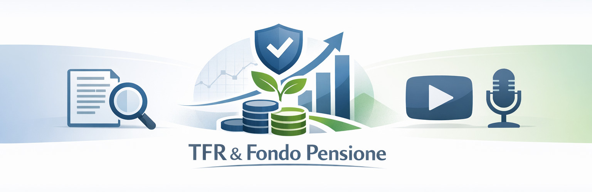

## ⚠️ **Disclaimer**

> **📚 ATTENZIONE:** Questo repository contiene informazioni e risorse relative al fondo pensione e alla previdenza complementare.
> 
> - 🤖 I documenti, gli audio e le infografiche sono state prodotte con [NotebookLM di Google](https://notebooklm.google/).
> - 🎓 Il repository è stato creato per scopi di studio e **non costituisce consulenza finanziaria**.
> - ⚖️ Non si assume alcuna responsabilità per l'uso delle informazioni contenute nel repository.
> - ©️ **La proprietà intellettuale dei contenuti appartiene ai rispettivi autori.**

## Notebook

Qui potete trovare il link al notebook su NotebookLM di Google: [Fondo pensione e TFR](https://notebooklm.google.com/notebook/b5e67a0a-ed18-4bc7-b458-cdf218a2c44a)

## Risorse

Queste sono le risorse che sono state prodotte con NotebookLM di Google. Non sono state date particolari personalizzazioni, ma sono state sfruttate direttamente le funzionalità della piattaforma nell'utilizzare le [fonti](#fonti) per produrre materiale didattico per studiare.
I documenti prodotti sono stati realizzati combinando tra loro più fonti per creare un quadro completo e dettagliato.

### Audio

| **Titolo** | **Audio** |
|-----------------|-----------------|
| The Bull - Guida pratica a TFR e pensione integrativa | [the-bull-guida-pratica-tfr-pensione-integrativa.mp3](audio/the-bull-guida-pratica-tfr-pensione-integrativa.mp3) |
| Ciao Elsa e Coletti | [ciao-elsa-e-coletti.mp3](audio/ciao-elsa-e-coletti.mp3) |
| Omney - Previdenza integrativa e fondo pensione | [omney-previdenza-integrativa-fondo-pensione.mp3](audio/omney-previdenza-integrativa-fondo-pensione.mp3) |

### Infografiche

| **Titolo** | **Infografica** |
|-----------------|-----------------|
| Guida previdenza complementare 2025-2026 |  |
| Tipi di fondi pensione |  |

### Documenti

- 📄 [Analisi di Impatto Normativo La Riforma della Previdenza Complementare nella Legge di Bilancio 2026](documenti/impatto-normativo-riforma-leggebilancio-2026.pdf)
- 📄 [Addio Pensione d’Oro: 7 Verità (e Opportunità) sulla Previdenza che la tua Banca non ti dice](documenti/verita-opportunita-previdenza-banca-non-dice.pdf)

## Fonti

- 📺 [109. La Guida definitiva alla Previdenza Complementare con Ciao Elsa](https://www.youtube.com/watch?v=o2MyJ5Hx2Nk)
- 📺 [267. Come salvare la tua pensione: tutto quello che devi sapere con Ciao Elsa](https://www.youtube.com/watch?v=LTzibm5jsdk)
- 📺 [48. La Previdenza Integrativa per Dipendenti e Partite IVA](https://www.youtube.com/watch?v=zmSWuOEBNuQ)
- 📺 [Educati e Finanziati Avanzati 04: il fondo pensione | corso base di finanza](https://www.youtube.com/watch?v=JYYEnGDMd18)
- 📺 [Fondo pensione: come costruire oggi il tuo futuro | The Bull](https://www.youtube.com/watch?v=VO0XCriYU7o)
- 📺 [La Guida Definitiva alla Previdenza Integrativa 💰 TFR, Fondi Pensione, Nuove Detrazioni...](https://www.youtube.com/watch?v=I1dGHISpyg8)
- 📺 [La Guida Definitiva sui Fondi Pensione 💰 (Come fare la scelta giusta?)](https://www.youtube.com/watch?v=AvKN1__yvow)
- 📺 [Legge di Bilancio 2026: novità su pensioni e previdenza complementare!](https://www.youtube.com/watch?v=3qIz2Vq3sbA)
- 📺 [Guida COMPLETA ai Fondi Pensione](https://www.youtube.com/watch?v=SNb6svLKtr8)
- 📺 [Ciao Elsa e Prof. Coletti](https://www.youtube.com/watch?v=bpcj71h4Gd0)

## Profili Social

- 🌐 [Ciao Elsa](https://www.ciaoelsa.com/)
- 🌐 [The Bull](https://www.thebull.it/)
- 🌐 [Omney](https://www.omney.io/)
- 🌐 [Riccardo Zanetti](http://www.youtube.com/@RiccardoZanetti)
- 🌐 [Pietro Michelangeli](https://www.youtube.com/@PietroMichelangeli)
- 🌐 [Paolo Coletti](https://www.youtube.com/@PaoloColetti)

## Vuoi Contribuire?

Hai una idea per migliorare il repository aggiungere una fonte, un contenuto, una analisi particolare o qualsiasi altra cosa? Crea una nuova issue e descrivimela.

